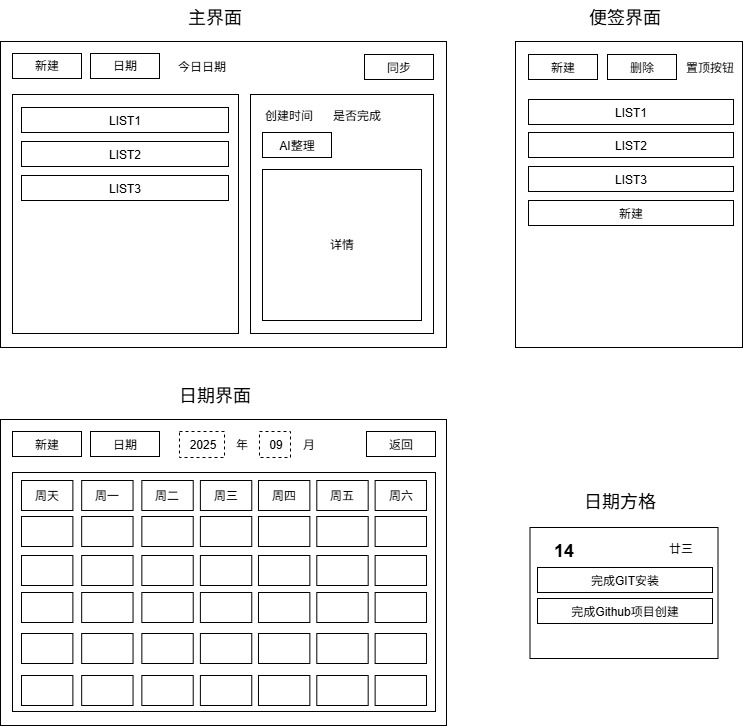
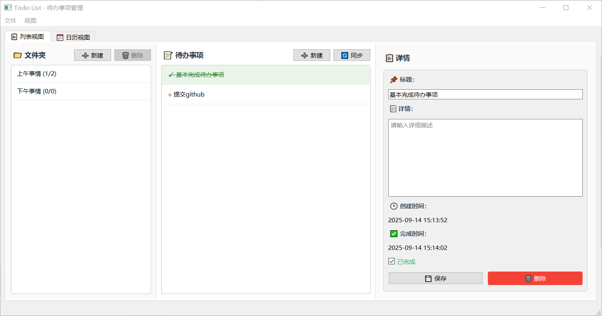
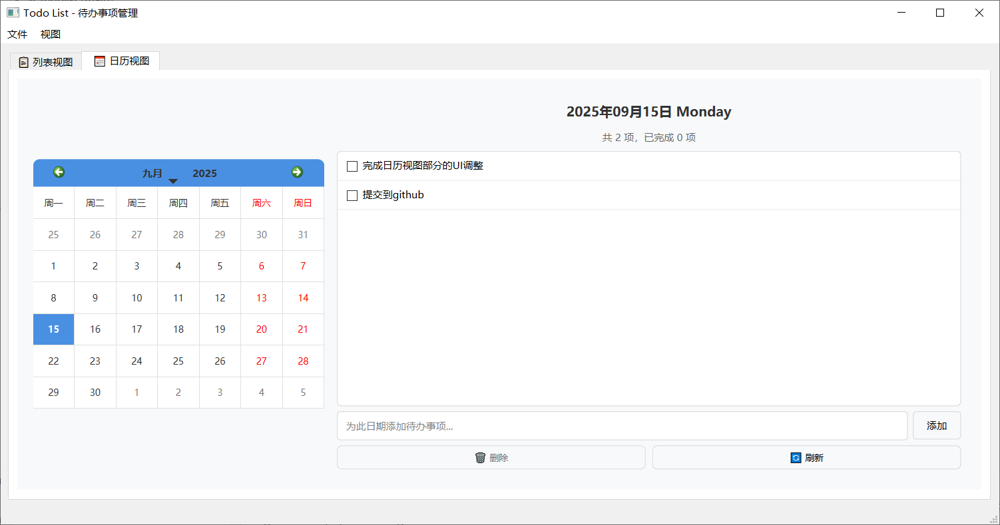
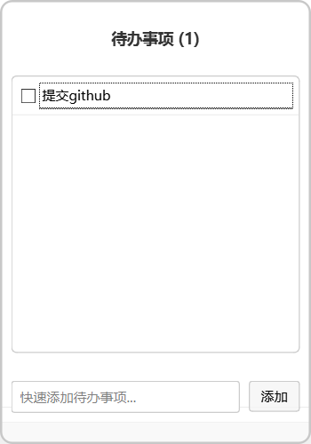

# TodoList 桌面应用

一个功能丰富的跨平台待办事项管理应用，支持桌面小贴士、日历视图、文件夹分类等多种功能。

## 📋 项目概述

本项目旨在创建一个完整的待办事项管理生态系统，包括：
- ✅ **Windows 桌面应用** - 主要功能已实现
- 🚧 **云端服务器** - 计划开发中
- 🚧 **Android 应用** - 计划开发中

## 🚀 主要功能

### 📝 待办事项管理
- **完整的 CRUD 操作**：创建、查看、编辑、删除待办事项
- **详细信息记录**：标题、详情、创建时间、完成时间
- **状态管理**：完成/未完成状态切换，完成项目自动变灰显示
- **数据持久化**：本地 JSON 格式存储
- **导入导出**：支持 JSON 格式的数据导入导出

### 📁 文件夹分类
- **多文件夹支持**：创建和管理多个待办事项分类
- **文件夹编辑**：重命名和删除文件夹
- **智能统计**：显示每个文件夹的待办和完成数量

### 📅 日历视图
- **日期关联**：待办事项与特定日期关联
- **可视化显示**：在日历上直观显示待办事项
- **快速操作**：直接在日历视图中添加、删除待办事项

### 🖥️ 桌面小贴士
- **置顶显示**：桌面悬浮窗口，始终可见
- **快速添加**：一键添加新的待办事项
- **状态切换**：直接在小贴士中标记完成状态
- **简洁界面**：完成项目显示删除线和灰色文字

## 🛠️ 技术栈

- **框架**：Qt 6.8.3 (C++)
- **构建工具**：MinGW 64-bit
- **数据存储**：JSON 本地文件
- **UI 设计**：Qt Widgets + 自定义样式

## 📦 项目结构

```
TodoList/
├── main.cpp              # 应用程序入口
├── mainwindow.cpp/h       # 主窗口实现
├── todoitem.cpp/h         # 待办事项数据模型
├── todofolder.cpp/h       # 文件夹数据模型
├── calendarwidget.cpp/h   # 日历视图组件
├── desktopwidget.cpp/h    # 桌面小贴士组件
├── mainwindow.ui          # 主界面布局
├── styles.qss             # 样式表
└── todolist.pro           # Qt 项目文件
```

## 🎯 开发状态

### ✅ 已完成功能
- [x] 基础待办事项管理（增删改查）
- [x] 文件夹分类系统
- [x] 桌面小贴士功能
- [x] 日历视图集成
- [x] 数据持久化存储
- [x] 导入导出功能
- [x] 完成状态视觉反馈
- [x] 为项目添加图标

### 🚧 计划开发
- [ ] **拖拽排序**：文件夹和待办事项拖拽调整
- [ ] **云端同步**：支持 GitHub、自建服务器同步
- [ ] **AI 智能整理**：集成 DeepSeek、本地大模型
- [ ] **整体UI升级**：调整UI更美观
- [ ] **服务端开发**：RESTful API 和数据同步
- [ ] **Android 应用**：移动端配套应用

## 🖼️ 界面预览

- 预期结果



- 完成效果








## 🔧 构建说明

### 环境要求
- Qt 6.8.3 或更高版本
- Windows 10/11 操作系统

### 构建步骤
1. 克隆项目到本地
2. 使用 Qt Creator 打开 `todolist.pro`
3. 配置 MinGW 64-bit 构建套件
4. 点击构建运行

## 📄 许可证

本项目采用开源许可证，详见 [LICENSE](LICENSE) 文件。

---

*注：标记为 🚧 的功能正在规划或开发中，标记为 ✅ 的功能已经完成并可以使用。*
